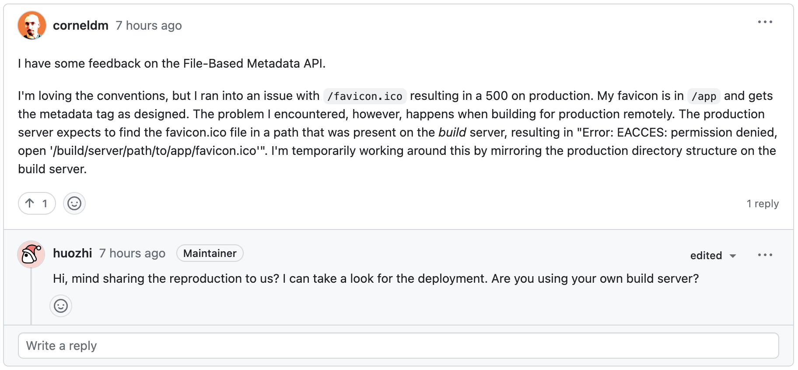

# Next.js Favicon Issue Reproduction



Source: https://github.com/vercel/next.js/discussions/41745#discussioncomment-5780610

# Overview

This app was created using `npx create-next-app@latest`, with the following options:

* TypeScript
* ESLint
* Tailwind CSS
* `src/` directory
* experimental `app/` directory

# Instructions

1. Using the terminal, Build & Run `Dockerfile-broken`

    ```sh
    docker build --no-cache -f ./Dockerfile-broken -t nextjs-favicon-repro .
    docker run -it -p 3000:3000 nextjs-favicon-repro
    ```
2. Visit `http://localhost:3000` in the browser.  Open the developer tools and visit the network tab.  Refresh the page & clear the cache if necessary.  Observe the 500 error when retrieving `favicon.ico`.
 
    Observe the following error in the console (repeats twice).

    ```
    Error: ENOENT: no such file or directory, open '/tmp/build/src/app/favicon.ico'
        at Object.openSync (node:fs:601:3)
        at Object.readFileSync (node:fs:469:35)
        at 8368 (/www/.next/server/app/favicon.ico/route.js:157:38)
        at __webpack_require__ (/www/.next/server/webpack-runtime.js:25:42)
        at __webpack_exec__ (/www/.next/server/app/favicon.ico/route.js:206:39)
        at /www/.next/server/app/favicon.ico/route.js:207:74
        at __webpack_require__.X (/www/.next/server/webpack-runtime.js:138:21)
        at /www/.next/server/app/favicon.ico/route.js:207:47
        at Object.<anonymous> (/www/.next/server/app/favicon.ico/route.js:210:3)
        at Module._compile (node:internal/modules/cjs/loader:1254:14) {
    errno: -2,
    syscall: 'open',
    code: 'ENOENT',
    path: '/tmp/build/src/app/favicon.ico'
    }
    TypeError: Cannot read properties of null (reading 'useContext')
        at exports.useContext (/www/node_modules/next/dist/compiled/react/cjs/react.production.min.js:28:118)
        at Head (/www/.next/server/pages/_error.js:282:44)
        at Wc (/www/node_modules/react-dom/cjs/react-dom-server.browser.production.min.js:68:44)
        at Zc (/www/node_modules/react-dom/cjs/react-dom-server.browser.production.min.js:70:253)
        at Z (/www/node_modules/react-dom/cjs/react-dom-server.browser.production.min.js:76:89)
        at $c (/www/node_modules/react-dom/cjs/react-dom-server.browser.production.min.js:78:98)
        at bd (/www/node_modules/react-dom/cjs/react-dom-server.browser.production.min.js:77:404)
        at Z (/www/node_modules/react-dom/cjs/react-dom-server.browser.production.min.js:76:217)
        at $c (/www/node_modules/react-dom/cjs/react-dom-server.browser.production.min.js:78:98)
        at Zc (/www/node_modules/react-dom/cjs/react-dom-server.browser.production.min.js:71:145)
    TypeError: Cannot read properties of null (reading 'useContext')
        at exports.useContext (/www/node_modules/next/dist/compiled/react/cjs/react.production.min.js:28:118)
        at Head (/www/.next/server/pages/_error.js:282:44)
        at Wc (/www/node_modules/react-dom/cjs/react-dom-server.browser.production.min.js:68:44)
        at Zc (/www/node_modules/react-dom/cjs/react-dom-server.browser.production.min.js:70:253)
        at Z (/www/node_modules/react-dom/cjs/react-dom-server.browser.production.min.js:76:89)
        at $c (/www/node_modules/react-dom/cjs/react-dom-server.browser.production.min.js:78:98)
        at bd (/www/node_modules/react-dom/cjs/react-dom-server.browser.production.min.js:77:404)
        at Z (/www/node_modules/react-dom/cjs/react-dom-server.browser.production.min.js:76:217)
        at $c (/www/node_modules/react-dom/cjs/react-dom-server.browser.production.min.js:78:98)
        at Zc (/www/node_modules/react-dom/cjs/react-dom-server.browser.production.min.js:71:145)
    ```

3. Stop the container

4. Using the terminal, Build & Run `Dockerfile-fixed`

    ```sh
    docker build --no-cache -f ./Dockerfile-fixed -t nextjs-favicon-repro .
    docker run -it -p 3000:3000 nextjs-favicon-repro
    ```

5. Visit `http://localhost:3000` in the browser.  Open the developer tools and visit the network tab.  Refresh the page & clear the cache if necessary.  Observe no error when fetching `favicon.ico` and see no errors in the terminal.